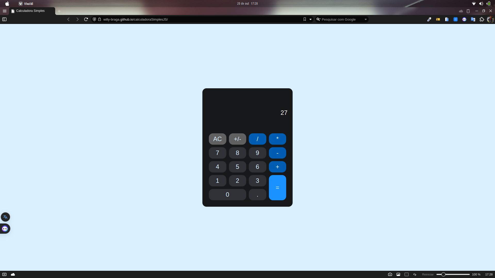
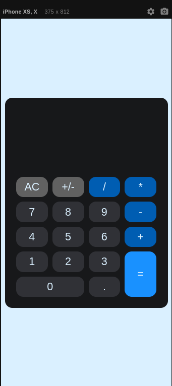

# Sobre Projeto:

Projeto criado com intenção de se testar e concretizar o conhecimento em JavaScript, para isso criei uma calculadora simples onde ela irá realizar os calculos básicos da matematica.
Baixe o código do projeto aqui: https://github.com/Willy-Braga/calculadoraSimplesJS.

[Projeto disponível](https://willy-braga.github.io/calculadoraSimplesJS/)

### Linguagens e Ferramentas

- HTML
- CSS
- Javascript
- Vscode
- Live Server

## Layout

### Desktop

### Mobile

<!-- [Figma do Projeto](https://figma.com/) -->

### Contribua com o projeto

- Realize o Fork
- Faça as modificações necessárias
- Realize a Pull Request (PR)

### Fucionalidades do Projeto

- [x] Realizar calculos

### Contribuidores

### Autor

[Licenca MIT License](http://creativecommons.org/licenses/by)
